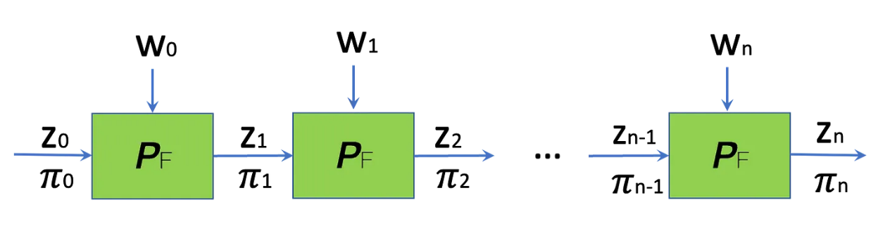

# Zimage Recognition

## Introduction
The current article explores the possibility of combining the inference of a neural network model inside a zero knowledge circuit. The circuits are written in circom and dont cover all the inferences. All the repeated inferences are folded into a single instance. Then proofs for all these foldings are calculated recursively using pasta curves.

## What is Nova?

Nova performs folding over R1CS constraint systems. R1CS is an arithmetization technique used for Nova deploys a scheme with relaxed R1CS at the begining and folding it N times. Relaxed R1CS means that the original R1CS is fed with a linear combination of two instances of solution vector. Let's assume that first solution vector is $s_1$ and second is $s_2$
$$ s_1 = [x_1, w_1]  $$ $$s_2 = [x_2, w_2]$$

Here $x$ is the public inputs and $w$ is the private witness

In R1CS we have,
$$ (A.s) (B.s) = C.s$$

Now with normal R1CS we will plug in $s_1$ first complete the evaluation of polynomials and then the proof is given to the verifier for verification through bilinear pairings (atleast this happens in **Groth'16**). 

In Nova we take a Relaxed Linear Combination(RLC) of two instances with an RLC factor $r$.

$$ (A.s) (B.s) = u(C.s) + E $$

$$ S= s_1+r.s_2 $$

By inputing it into the R1CS equation, we have 
$$ (A.(s_1+r.s_2))(B.(s_1+r.s_2)) = C.(s_1+r.s_2) $$

After solving this equation we have, 
$$ (A.S)(B.S) = u.(C.S) + (D.s') + (E) $$

$$ u = u_1 + r.u_2 $$

$$ e = e_1 + r^2.T $$

$$ T = Az_1.Bz_2 + As_2.Bs_1-u_1Cz_2-u_2Cz_1$$

This is the extra terms we are getting in relaxed R1CS and they are committed by the prover to be used in future for verfication. 

The constraints generated on the final step are used with interactive oracle proof(IOP) i.e. Spartan for generating the proofs.

## Private Facial Recognition using ZK-SNARKs

Presently, Banana accounts are utilizing a solution based on secure multi-party computation (MPC) for wallet recovery in case of a lost device. However, this approach involves a certain degree of centralization, as the three shards of the recovery mechanism are stored in different centralized entities:

- The user’s Google Drive, authenticated using Google sign-in.
- Our server, authenticated using an email ID.
- The third shard is encrypted and converted into a QR code, which the user can share with a trusted family member or friend.

To eliminate the dependency on centralized entities, I am exploring the use of private neural networks combined with ZK-SNARKs for facial recognition. In this scenario, the user would scan their face, and if the facial features match, verifying the proof would be sufficient for the smart contract to validate the correctness of the face.